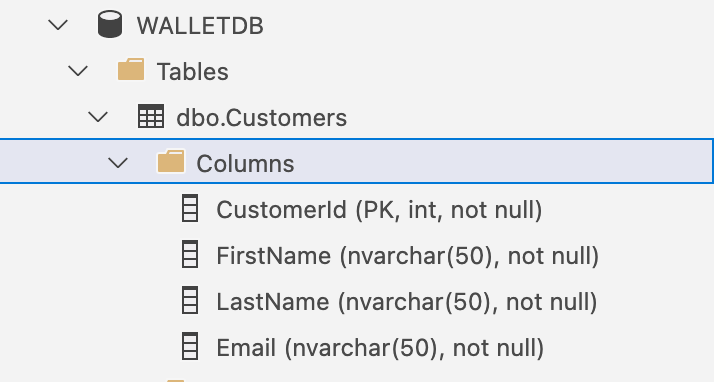
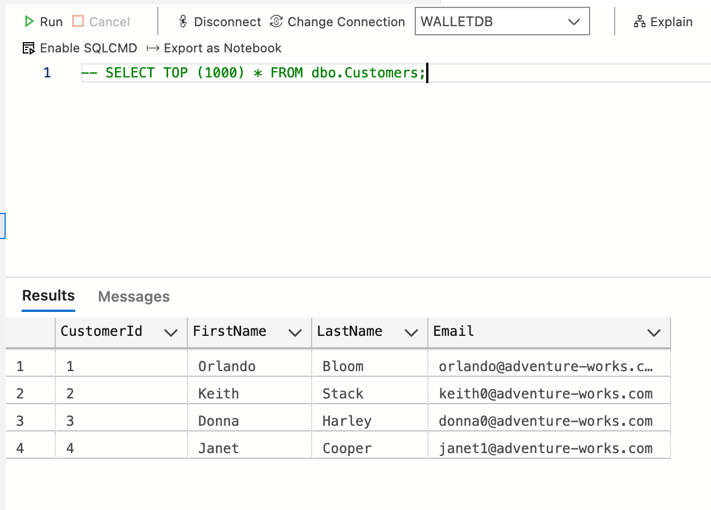

# Assignment - Week 3

1. Serbest konulu seçilen Web API için database yaratmak, log ve diğer modeller için bir tablo oluşturmak

2. SQL de yaratılan veritabanın .bak uzantılı dosyasını yüklemek

## Create a Database on SQL Server using Azure Data Studio

1. ### Create a New Database

```
   USE master
   GO

   IF NOT EXISTS (
   SELECT name
   FROM sys.databases
   WHERE name = N'WALLETDB'
   ) CREATE DATABASE [WALLETDB];

   GO

   IF SERVERPROPERTY('ProductVersion') > '12'
   ALTER DATABASE [WALLETDB] SET QUERY_STORE=ON;

   GO

```

2. ### Create a new table

```
   -- Create a new table called 'Customers' in schema 'dbo'
   -- Drop the table if it already exists

   IF OBJECT_ID('dbo.Customers', 'U') IS NOT NULL DROP TABLE dbo.Customers;

   GO
```

```
   -- Create the table in the specified schema

   CREATE TABLE dbo.Customers
   (
   CustomerId int IDENTITY(1,1) NOT NULL PRIMARY KEY, -- primary key column, auto incremented
   FirstName nvarchar(50) NOT NULL,
   LastName nvarchar(50) NOT NULL,
   Email nvarchar(50) NOT NULL,
   );

   GO
```



1. ### Insert rows

   -- Insert rows into table 'Customers'

```
   INSERT INTO dbo.Customers

   ([FirstName], [LastName], [Email])

   VALUES

   ( N'Orlando', N'Bloom', N'orlando@adventure-works.com'),
   ( N'Keith', N'Stack', N'keith0@adventure-works.com'),
   ( N'Donna', N'Harley', N'donna0@adventure-works.com'),
   ( N'Janet', N'Cooper', N'janet1@adventure-works.com')

   GO
```

4. ### View the data returned by a query

   -- Select rows from table 'Customers'

<code>SELECT TOP (1000) \* FROM dbo.Customers;</code>



#### References

- [Use Azure Data Studio to connect and query SQL Server](https://docs.microsoft.com/en-us/sql/azure-data-studio/quickstart-sql-server?view=sql-server-ver15)
