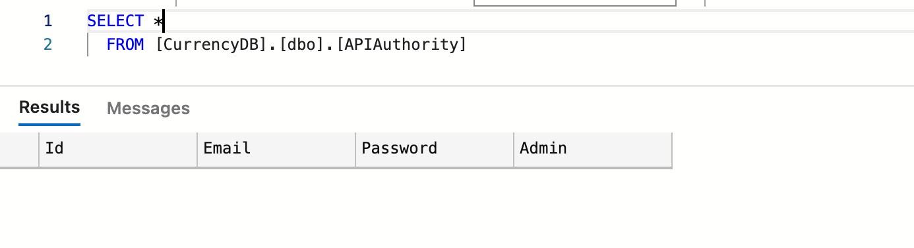
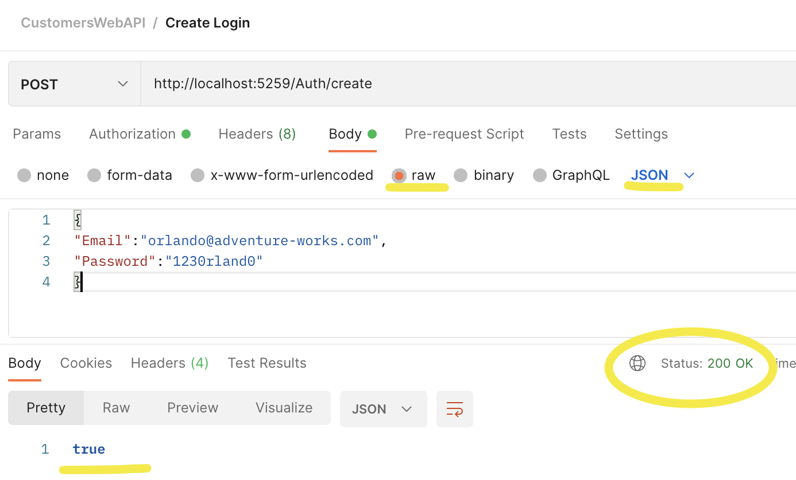
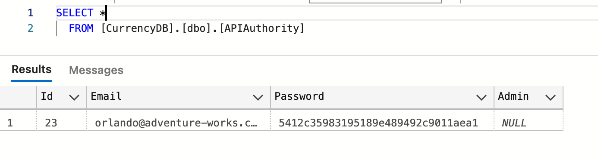
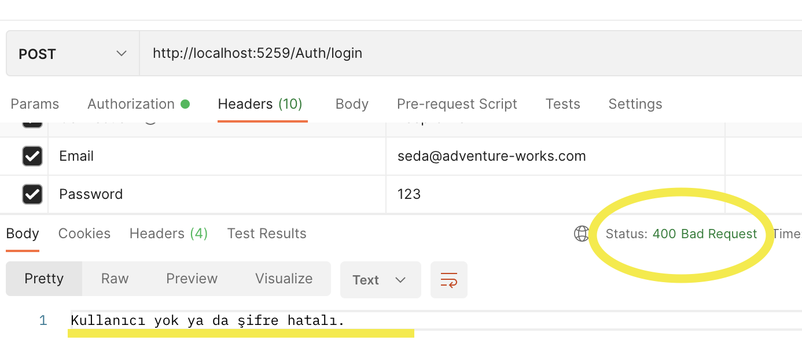
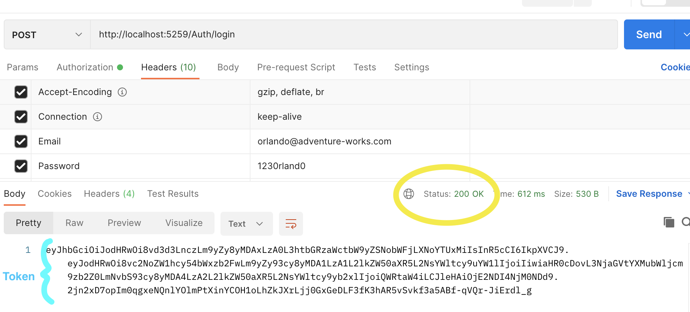

# Adding in Authentication to EntityFramework Web API Project

## Create new login record and hash customer password with MD5

### APIAuthority Table Before

### Create login

### APIAuthority Table After

## Login Customer

### Select Bearer Token on Postman Authorization

### Login Failed

### Successful login for customer

