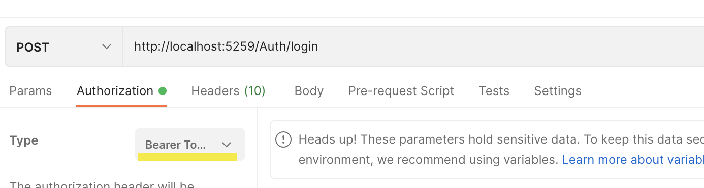

# Adding in Authentication to EntityFramework Web API Project

## 1. Create new login record and hash customer password with MD5

### 1.1. APIAuthority Table Before

### 1.2. Create Login

### 1.3. APIAuthority Table After

## 2. Login Customer

### 2.1. Select Bearer Token on Postman Authorization

### 2.2. Login Failed

### 2.3. Successful login for customer

