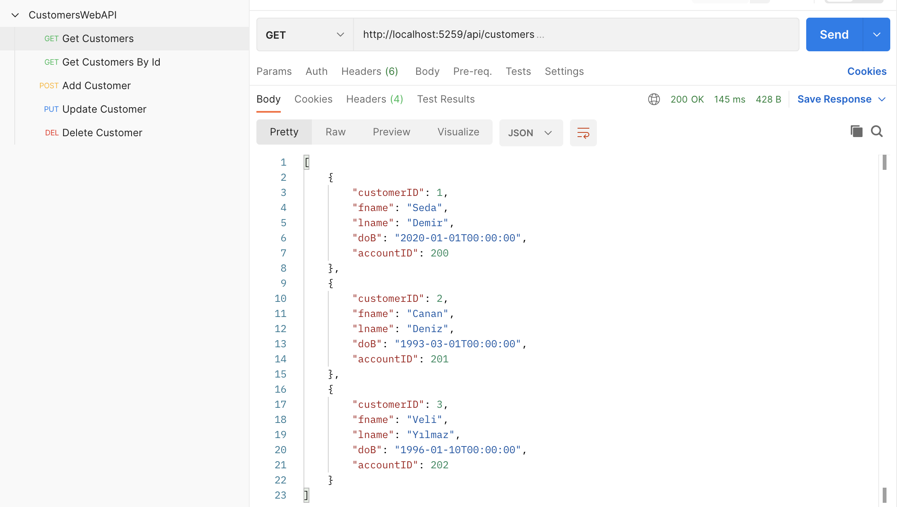

# CustomersWebAPI project

## Requests via Postman

1. Get Request => Get all customers
2. Get Request by id => Get customer by id
3. Post Request => Add customer
4. Put request => Update customer
5. Delete request => Delete customer

### Get all customers

### Get customer by id

### Add customer

### Update customer

### Delete customer

